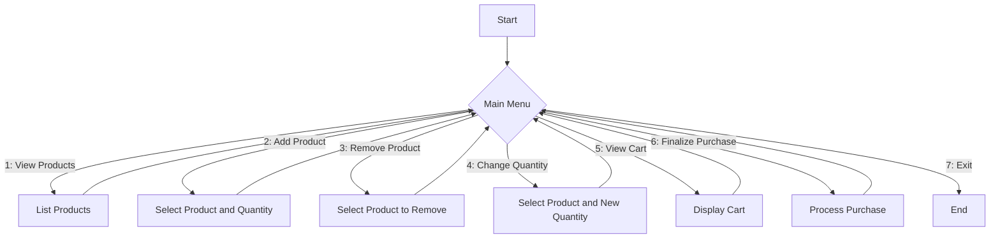

# Shopee Terminal - Simulador de Carrinho de Compras 🛒💻


**Bem-vindo ao Shopee Terminal!** Este projeto traz a experiência de compras da Shopee diretamente para o seu terminal, utilizando apenas Node.js puro. Aqui você pode adicionar, remover, alterar quantidades e finalizar suas compras como um verdadeiro cliente online!

## 🚀 Visão Geral do Projeto

O "Shopee Terminal" é um simulador de carrinho de compras desenvolvido em Node.js, que replica a funcionalidade essencial de um e-commerce diretamente no terminal. O objetivo principal é demonstrar a construção de um sistema de gerenciamento de produtos e carrinho de compras utilizando JavaScript puro no backend. Este projeto é ideal para quem busca entender a lógica de um sistema de e-commerce e a interação com o usuário via linha de comando.

## ✨ Funcionalidades Principais

*   **Listagem de Produtos:** Exibe uma lista clara e organizada dos produtos disponíveis na loja.
*   **Adição de Produtos:** Permite adicionar itens ao carrinho, especificando a quantidade desejada.
*   **Remoção de Produtos:** Possibilita remover produtos do carrinho a qualquer momento.
*   **Alteração de Quantidade:** Ajusta a quantidade de um produto já existente no carrinho.
*   **Visualização Detalhada do Carrinho:** Apresenta um resumo completo do carrinho, incluindo produtos, quantidades, preços unitários e o total da compra.
*   **Finalização da Compra:** Simula o processo de checkout, consolidando os itens e calculando o valor final.

## 🛠️ Tecnologias Utilizadas

*   **Node.js:** Ambiente de execução JavaScript server-side.
*   **JavaScript:** Linguagem de programação principal para toda a lógica do sistema.

## 📚 Como Usar

Para executar o Shopee Terminal em sua máquina local, siga os passos abaixo:

1.  **Clone o repositório:**
    ```bash
    git clone https://github.com/galafis/Carrinho-de-Compras-da-Shopee-com-Node.js.git
    ```
2.  **Navegue até o diretório do projeto:**
    ```bash
    cd Carrinho-de-Compras-da-Shopee-com-Node.js
    ```
3.  **Instale as dependências (se houver):**
    ```bash
    npm install
    ```
    (Neste projeto, não há dependências externas, mas é uma boa prática incluir este passo).
4.  **Execute o aplicativo:**
    ```bash
    node src/index.js
    ```
5.  **Interaja:** Siga as instruções no terminal para navegar pelo menu e realizar suas compras.

## 💡 Inspiração

Este projeto foi desenvolvido como parte do desafio da Formação Node.js da DIO, com inspiração na interface e experiência de compra do popular site de e-commerce Shopee.

## 📄 Licença

Este projeto está licenciado sob a Licença MIT. Veja o arquivo [LICENSE](LICENSE) para mais detalhes.

## 👨‍💻 Autor

**Gabriel Demetrios Lafis**

*   [GitHub](https://github.com/galafis)
*   [LinkedIn](https://www.linkedin.com/in/gabriel-demetrios-lafis/)

---

## 📊 Fluxo do Aplicativo


# Shopee Terminal - Shopping Cart Simulator 🛒💻 (English Version)


**Welcome to Shopee Terminal!** This project brings the Shopee shopping experience directly to your terminal, using only pure Node.js. Here you can add, remove, change quantities, and finalize your purchases like a true online customer!

## 🚀 Project Overview

The "Shopee Terminal" is a shopping cart simulator developed in Node.js, replicating the essential functionality of an e-commerce directly in the terminal. The main objective is to demonstrate the construction of a product and shopping cart management system using pure JavaScript on the backend. This project is ideal for those looking to understand the logic of an e-commerce system and user interaction via the command line.

## ✨ Main Features

*   **Product Listing:** Displays a clear and organized list of available products in the store.
*   **Add Products:** Allows adding items to the cart, specifying the desired quantity.
*   **Remove Products:** Enables removing products from the cart at any time.
*   **Change Quantity:** Adjusts the quantity of an existing product in the cart.
*   **Detailed Cart View:** Presents a complete summary of the cart, including products, quantities, unit prices, and the total purchase amount.
*   **Checkout:** Simulates the checkout process, consolidating items and calculating the final value.

## 🛠️ Technologies Used

*   **Node.js:** Server-side JavaScript runtime environment.
*   **JavaScript:** Main programming language for all system logic.

## 📚 How to Use

To run Shopee Terminal on your local machine, follow the steps below:

1.  **Clone the repository:**
    ```bash
    git clone https://github.com/galafis/Carrinho-de-Compras-da-Shopee-com-Node.js.git
    ```
2.  **Navigate to the project directory:**
    ```bash
    cd Carrinho-de-Compras-da-Shopee-com-Node.js
    ```
3.  **Install dependencies (if any):**
    ```bash
    npm install
    ```
    (In this project, there are no external dependencies, but it is good practice to include this step).
4.  **Run the application:**
    ```bash
    node src/index.js
    ```
5.  **Interact:** Follow the instructions in the terminal to navigate the menu and make your purchases.

## 💡 Inspiration

This project was developed as part of the DIO Node.js Training challenge, inspired by the interface and shopping experience of the popular e-commerce site Shopee.

## 📄 License

This project is licensed under the MIT License. See the [LICENSE](LICENSE) file for more details.

## 👨‍💻 Author

**Gabriel Demetrios Lafis**

*   [GitHub](https://github.com/galafis)
*   [LinkedIn](https://www.linkedin.com/in/gabriel-demetrios-lafis/)

---

## 📊 Application Flow



